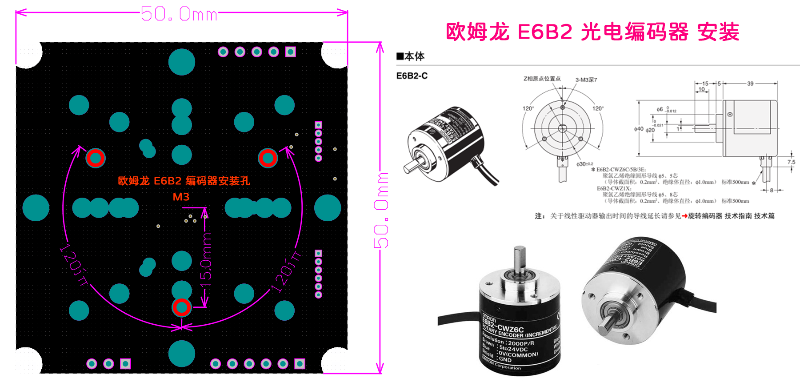

# MT6701磁编码器芯片简介

&emsp;&emsp;MT6701是麦歌恩（MagnTek）公司的磁性角度传感器芯片，提供14Bit 0~360°单圈绝对角度检测，拥有 `ABZ/PWM/模拟量/I2C/SSI` 等多种信息输出方式，还可根据磁场强度的瞬时变化提供非接触式按压检测功能。能够以较低的成本来替代传统光电编码器，可应用于绝对值角度输出、闭环步进电机BLDC电机旋转角度检测、机器人关节、非接触按键、非接触电位器等场合。

 

&emsp;&emsp;鉴于其数据手册的介绍已经非常详细，且有中文PDF版本，建议大家先读一遍官方手册：[MT6701_Rev.1.6_中文版](http://www.magntek.com.cn/upload/MT6701_Rev.1.6_%E4%B8%AD%E6%96%87%E7%89%88.pdf)

 

 

&emsp;&emsp;MT6701提供 `ABZ/UVW/PWM/模拟量/I2C/SSI` 等多种信息输出方式，建议优先选择 I2C/SSI 数字接口使用。

&emsp;&emsp;I2C除了获取角度外，还可用于对其内部 EEPROM编程，来更改 `ABZ/UVW/模拟量/PWM `的配置参数和校准参数。
&emsp;&emsp;其 SSI 与SPI兼容，仅需要 SCK、MISO、CS 三个IO。

 

---
# STM32 HAL库源码

源码见文件夹 

详细介绍请对照博文：[CSDN - MT6701磁编码器使用指南，14Bit单圈绝对值，I2C stm32 HAL库读角度](https://blog.csdn.net/Mark_md/article/details/126910658)

 

---
# 个人小店在售电机转接板资料
原理图：[Schematic_MT6701_Universal_Adapter_Brd](mt6701_brd/Schematic_MT6701_Universal_Adapter_Brd_2022-09-12.pdf)

`ABZ/UVW/PWM/模拟量/I2C/SSI` 接口均已引出，PCB外形可适配 22xx、2606、2804、35xx、6010、6374、36/42/57步进 等多种电机的安装。

TB店铺名：芯源艺码

 

## 适配电机安装孔位

